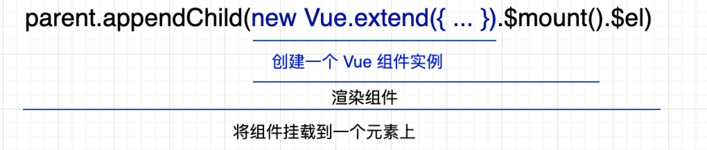

## 一、Form 具有数据校验功能的表单组建
> 用到的组件间通信方式

provide / inject : 把 form 实例分发给 FormItem，常用于获取父组件的状态

this.dispatch / this.$on, this.broadcast / this.$on，常用于父子组件间通过自定义事件进行通信

ref = "form"

> 验证功能的实现办法

使用 npm 包 async-validate, 用户输入的数据 model 和验证规则 rules

验证在 FormItem, 有 2 种验证方式：单项验证、点击 "提交" 后一起验证

> 一种重要思想

缓存组件实例

## 二、Display 动态渲染组件
> 用途

只需要修改某个 .vue 文件就可以实现更新，不需要重新打包、编译、上传等操作

> 核心实现步骤

> 实现难点：构建 Vue.extend() 的参数

1、使用 return 包裹 export default 里面的内容

2、使用 new Function(this.js)() 执行语句，生成 Vue.extend() 需要的参数内容

## 三、Alert 全局提示组件

> 核心实现办法

- Vue.prototype.$Vue 全局挂载
- newInstance方法的实现
   
    子组件实例扩展 newInstance 方法，在该方法里边，新生成一个提示框实例，并且暴露该实例的 add 方法，方便外部调用生成新的提示框实例。

## 四、Tree 树形控件

## 五、总结

  模仿写组件最大心得：看 iVue 的官网里面的接口，依次为起点<b>尝试去自己实现</b>，遇到难题了自己先想解决办法，然后参考 iView 源码的解决办法，然后自己总结出一套完美的实现办法。
  but, 前提是先把<b>官网</b>仔细过一遍